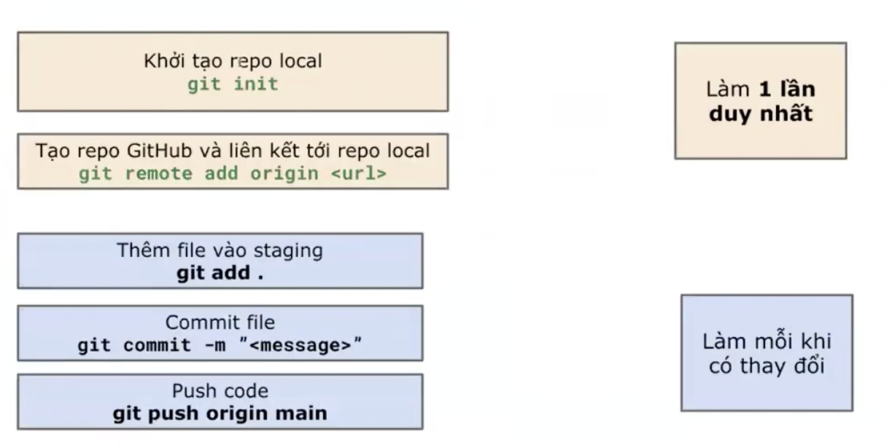

# Cài đặt chung
## NVM
- **NVM** = Node Version Manager = quản lý các phiên bản NodeJs
- **NodeJs** = Công cụ để chạy code

## Git & GitHub
- **Git**: quản lý source code
- **GitHub**: chia sẻ code, làm việc nhóm

#### Cấu hình Git 
- Trước khi làm việc với Git, cần một số cấu hình mặc định:

    - Config **username** (tên người dùng):

        ```bash 
        git config --global user.name "<tên bạn>"
        ```

    - Config **email** (địa chỉ email):

        ```bash
        git config --global user.email "<email của bạn>"
        ```

    - Config **branch default** (nhánh mặc định):

        ```bash
        git config --global init.defaultBranch main
        ```

#### Kết nối GitHub: Tạo SSH key
- Lệnh tạo SSH Keys: 
 `ssh-keygen -t rsa -b 4096 -C "your_email@example.com"`

 - Lấy nội dung ssh key: 
 ` cat ~/.ssh/id_rsa.pub`

- Truy cập:
`https://github.com/settings/ss h/new` để thêm ssh key

####  Cài đặt Playwright
- Tạo thư mục: **demo-1**
- Mở thư mục bằng **VS Code**
- Mở **terminal** lên
- Chạy lệnh:

    ` npm init playwright@latest`
- Liên tục gõ **"enter"**

#### Đưa code lên GitHub
