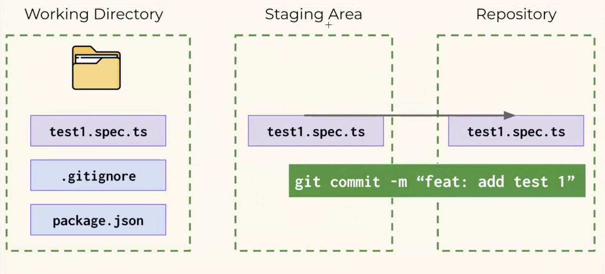
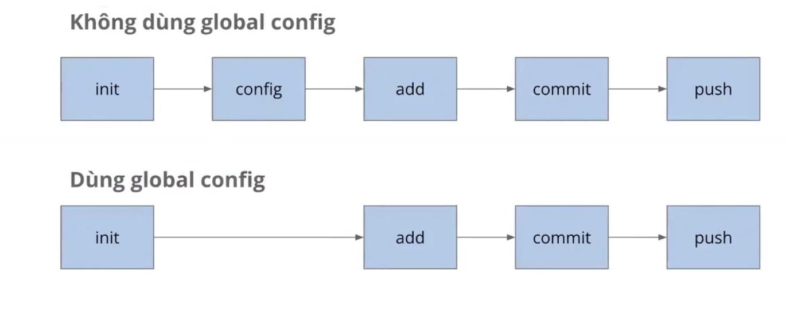

# Cài đặt chung
## NVM
- **NVM** = Node Version Manager = quản lý các phiên bản NodeJs
- **NodeJs** = Công cụ để chạy code

## Git & GitHub
- **Git**: quản lý source code
- **GitHub**: chia sẻ code, làm việc nhóm

#### Cấu hình Git 
- Trước khi làm việc với Git, cần một số cấu hình mặc định:

    - Config **username** (tên người dùng):

        ```bash 
        git config --global user.name "<tên bạn>"
        ```

    - Config **email** (địa chỉ email):

        ```bash
        git config --global user.email "<email của bạn>"
        ```

    - Config **branch default** (nhánh mặc định):

        ```bash
        git config --global init.defaultBranch main
        ```

#### Kết nối GitHub: Tạo SSH key
- Lệnh tạo SSH Keys: 
 `ssh-keygen -t rsa -b 4096 -C "your_email@example.com"`

 - Lấy nội dung ssh key: 
 ` cat ~/.ssh/id_rsa.pub`

- Truy cập:
`https://github.com/settings/ss h/new` để thêm ssh key

####  Cài đặt Playwright
- Tạo thư mục: **demo-1**
- Mở thư mục bằng **VS Code**
- Mở **terminal** lên
- Chạy lệnh:

    ` npm init playwright@latest`
- Liên tục gõ **"enter"**

#### Đưa code lên GitHub


---

# Tổng quan kiến thức về Git

## 1. Ba vùng trạng thái trong Git

Git hoạt động dựa trên **3 vùng chính**:

### 1.1 Working Directory
- Nơi chỉnh sửa file
- File chưa được đưa vào staging

### 1.2 Staging Area
- Nơi chuẩn bị commit
- Sử dụng lệnh:

```bash
git add <file>   # Thêm 1 file
git add .        # Thêm toàn bộ file
```

### 1.3 Repository (Local)
- Nơi lưu commit chính thức
- Sủ dụng lệnh:
```bash
git commit -m"message"
```

---

## 2. Git Workflow cơ bản

**Flow cơ bản**



**Flow phổ biến:**

```bash
git init
git add .
git commit -m "message"

```

#### Git - commit convention
`<type>: <short_description>`

- Trong đó:

    - **type:** loại commit

        - **chore:** sửa nhỏ lẻ, chính tả, xóa file không dùng tới,... 
        - **feat:** thêm tính năng mới, test case mới 
        - **fix:** sửa lỗi 1 test trước đó

    - **short_description:** mô tả ngắn gọn (50 kí tự), tiếng Anh hoặc tiếng Việt không dấu.

#### Git - Simple workflow




---
## 3. Các lệnh Git quan trọng

### 3.1 Kiểm tra trạng thái
```bash
git status
```
### 3.2 Xem lịch sử commit 
```bash
git log
```
### 3.3 Push code lên git
```bash
git remote add origin <repo-url>
git push origin main
```
# Git Undo Guide 🛠️


## 1. Từ Staging Area → Working Directory
Dùng khi đã chạy lệnh `git add` nhưng chưa `git commit` và muốn đưa file ra khỏi danh sách chuẩn bị.

* **Restore cụ thể một file:**
    ```bash
    git restore --staged <file_name>
    ```
* **Restore toàn bộ các file:**
```bash
    git restore --staged .
```


## 2. Từ Repository → Working Directory (Un-commit)
Dùng khi đã chạy `git commit` nhưng muốn quay lại để sửa đổi thêm mà không làm mất nội dung đã viết.

* **Cú pháp tổng quát:**
```bash
    git reset HEAD~<số_commit>
```
* **Ví dụ: Hủy 2 commit gần nhất:**
```bash
    git reset HEAD~2
```

## 3. Git Amend

#### 3.1 Sửa đổi commit gần nhất
```bash
git commit --amend
```

##### Note: sửa trong chế độ VIM
- Bấm I để hiện chữ insert -> sửa commit
- Sau khi sửa xong thì bấm esc để thoát
- Tiếp tục gõ lệnh: `:wq`

#### 3.2 Thêm file, Sửa đổi commit gần nhất và thay đổi message

```bash
git add <ten_file>
git commit --amend -m"<Nội dung message>"
```
#### 3.3 Thêm file vào commit cuối cùng
```bash
git add <ten_file>
git commit --amend --no--edit //Giữ nguyên message cũ cuối cùng
```
##### Note: Đưa thêm file từ vùng Staging -> Repository nhưng không muốn sửa nội dung commit

#### 3.4 Bỏ file khỏi commit cuối cùng
```bash
git reset HEAD~file_to_remove
git commit --amend --no--edit
```

###Cách hoạt động bên trong
Khi bạn chạy `git commit --amend`, Git thực chất:
1. Lấy nội dung của commit cuối (parent, tree, author)
2. Kết hợp với staging area hiện tại
3. Tạo một **commit mới với hash khác** thay thế commit cũ
4. Commit cũ vẫn tồn tại trong reflog nhưng không còn trên branch

```bash
Trước amend:                 Sau amend:

A -- B -- C                  A -- B -- C' (C' thay thể C, hash khác) 
```

---

# 🌿 Branching trong Git

## 1. Tạo branch

```bash
    git branch <ten_nhanh>
```

## 2. Di chuyển sang branch

```bash
git checkout <ten_nhanh>
```


#### 🔍 Kiểm tra branch hiện tại

```bash
git branch
```
👉 Branch đang đứng sẽ có dấu *


#### 🚀 Tạo branch + chuyển luôn

 ```bash
git checkout -b <ten_nhanh>
 ```

## 3. Xoá branch
 ```bash
    git branch -D <ten_nhanh> 
 ```
##### ⚠️ Lưu ý:

- Không được đứng ở branch cần xoá
- Nên chuyển sang branch khác (main/develop) trước

```bash
git checkout main
git branch -D <ten_nhanh>
```

--- 

# 🚫 Git Ignore File

## 📌 Các file không cần đưa lên Git Repository


#### Trong dự án có nhiều file không cần thiết phải commit lên Git

```bash
    - File tạm thời của hệ điều hành (.DS_Store, Thumbs.db)
    - Thư mục dependencies (node_modules/, vendor/)
    - File build và artifacts (dist/, build/, .exe)
    - File cấu hình cá nhân (IDE setting, environment)
    - File nhạy cảm (API keys, passwords, certificates)
    - File log và database local
```

#### ⚙️ Cách để Git bỏ qua file

##### 1. Tạo file .gitignore

##### 2. Thêm file/folder cần ignore
```bash
# Ví dụ
node_modules/
dist/
.env
.DS_Store
```

##### 3. Git sẽ tự động bỏ qua

```bash
Các file được khai báo trong .gitignore sẽ không được add vào Git
```


---

# ⚡ JavaScript Basic

## 1. Convention (Quy tắc đặt tên code)

### 1.1 snake_case
- 👉 Các từ viết thường, nối với nhau bằng dấu `_`

**Ví dụ:**
```bash
thu_qua
user_name
```

### 1.2 kebab-case
- 👉 Các từ viết thường, nối với nhau bằng dấu `-`

**Ví dụ:**
```bash
thu-qua
user-name
```

### 1.3 camelCase
- 👉 Viết thường chữ đầu, các từ sau viết hoa chữ cái đầu

**Ví dụ:**
```bash
thuQua
userName
```

### 1.4 PascalCase
- 👉 Mỗi từ đều viết hoa chữ cái đầu

**Ví dụ:**
```bash
ThuQua
UserName
```

### 1.5 SCREAMING_SNAKE_CASE
- 👉 Tất cả chữ viết hoa
- 👉 Các từ nối với nhau bằng dấu `_`

**Ví dụ:**
```bash
THU_QUA
USER_NAME
```

## 🎯 Mục đích sử dụng Conventions

| Convention   | Mục đích sử dụng        |
|-------------|-------------------------|
| snake_case  | Tạm thời không dùng     |
| kebab-case  | Đặt tên file, folder    |
| camelCase   | Đặt tên biến, hàm       |
| PascalCase  | Đặt tên class           |

## 2. Javascript

### 2.1 Console.log

#### Sử dụng nháy đơn, nháy kép
```bash
console.log('Toi la Thu Qua')
console.log("Toi la Thu Qua")
```
#### Sử dụng kèm variable

```bash
let name = "Thu Qua"
console.log(`Toi la ${name}`)
```
#### Sử dụng cộng chuỗi
```
console.log("Toi ten la" + name + " ")
```

### 2.2 Object
#### Cú pháp
```bash
const myInfo = {
    "name": "Thu Qua",
    address: "Da Nang", // nên dùng
    'favoriteNumber': 30,
    "address 2": "Quang Nam"
};
```
#### Truy xuất giá trị bên trong object
- Sử dụng dấu chấm: Nếu key không chứa dấu chấm, ký tự đặc biệt
- Sử dụng dấu ngoặc vuông: Nếu key chứa dấu chấm, ký tự đặc biệt

```bash
console.log(myInfo.name);
console.log(myInfo.["name"]);
```

### 2.3 Array

- **Tạo mảng**

    - Khai báo
    - Sử dụng

- **Truy suất mảng**

    - Độ dài mảng: lenght
    - Lấy phần tử theo index: [0], [1]

### 2.4 Function
```bash
Function = Hàm
Đoạn code dùng đi dùng lại
```

#### Ví dụ
```javascript
const dai = 5;
const rong = 10;

function tinhDienTich (dai, rong) {
const dienTich = dai * rong;
return dienTich;
}

console.log(tinhDienTich(5,10));
console.log(tinhDienTich(20,5));
```


# Javascript
## 1. Phạm vi của biến
### 1.1 Block scope (khối)
- Biến được **khai báo** trong **cặp ngoặc nhọn** 

    - **var**: không bị giới hạn bởi cặp ngoặc nhọn
    - **let/const:** bị giới hạn bởi cặp ngoặc nhọn. Ra ngoài bị **undefined**


###### ví dụ:
```javascript
if (true) {

var varVariable = "var không có block scope";
let letVariable = "let có block scope" ; 
const constVariable = "const cũng có block scope";
}

console.log(varVariable); // OK - var không bị giới hạn bởi block 
console. log(letVariable); // Error: letVariable is not defined 
console. log(constVariable); // Error: constVariable is not defined
```

### 1.2 Function scope (hàm)
- Biến được **khai báo** trong một **hàm**

    - Cả **let/var/const ra ngoài hàm** đều bị **undefined**

##### Ví dụ:

```javascript
function myFunction() {

var functionScoped = "Chỉ có thể truy cập trong hàm này"; 
let alsoFunctionScoped = "Tương tự";

console. log (functionScoped); // 0K

}

console. log(functionScoped); // Error: functionScoped is not defined
```

### 1.3 Toàn cục (global)
- Biến được khai báo trong ở một **dòng code tự do, không nằm** trong **khối** hay **hàm**

##### Ví dụ:
```javascript
var globalVar = "Tôi là biến toàn cục"; 
let globalLet = "Tôi cũng là biến toàn cục";

function testFunction() {

console. log(globalVar); // Truy cập được 
console. log(globalLet); // Truy cập được 
｝
```

## 2. Break and continue

##### break dùng để thoát khỏi vòng lặp ngay lập tức

```javascript
for (let i = 0; i < 10; i++) {

if (i === 5) {

break; // Thoát vòng lặp khi i = 5

}
console. log(i);

}
```

##### continue dùng để bỏ qua phần còn lại của vòng lặp hiện tại và chuyển sang lần lặp tiếp theo

```javascript
for (let i = 0; i < 10; i++) {

if (i % 2 === 0) {

    continue; // Bỏ qua số chẵn
    
    }
console. log(i);

｝
```

## 2. Câu điều kiện nâng cao

### 2.1 Câu điều kiện if... else
-  Thực thi code khác nhau cho trường hợp true và false

```javascript
let score = 75;

if (score >= 60) {

console.1og( "Bạn đã qua môn"); 
} else {

console.log("Bạn cần học lại");
}
```

### 2.2 Câu điều kiện if...else...if
- Kiểm tra nhiều điều kiện theo thứ tự

```javascript
let score = 85;
if (score >= 90) {
    console.1og("Xuất sắc"); 
} else if (score >= 80) { 
    console.log( "Giỏi"); 
} else if (score >= 70) {
    console.1og ("Khá");
} else if (score >= 60) {   
    console.1og("Trung binh"); 
} else {
    console. log("Yếu");
}
```

### 2.3 Ternary Operator (toán tử điều kiện)
- Cách viết ngắn gọn cho if...else

```javascript
const age = 20;
let status = (age >= 18) ? "Người lớn" : "Trẻ em";
console. log(status); // "Người lớn"

// Có thể lồng nhau (nên cẩn thận với độ phức tạp) 
let score = 75;
let grade = score >= 90 ? "A" :
            score >= 80 ? "B" :
            score >= 70 ? "C" :
            score >= 60 ? "D" : "F";
```

### 2.4 for...in Loop
- Dùng để duyệt qua các **thuộc tính** (properties) của một object

```javascript
const person = {
    name: "John",
    age: 30,
    city: "Hanoi",
    oldAddress: { 
        city: "Hai Duong",
        age: 100 
    }
};
for (const key in person) {
    console.log(key);
}
```

### 2.5 forEach Method
- Method của Array để thực thì một function cho mỗi phần tử. **Không thể** dùng **break** hoặc **continue**.

```javascript
const numbers = [11, 2, 3, 4, 51];
numbers.forEach(function (value) {

console. log (value) ;

});
```

### 2.6 Utils function - String
- **Utils function** là các **hàm có sẵn** của JavaScript, giúp việc **code** trở nên nhanh hơn, gọn hơn.

- Ta có 2 loại utils function thường sử dụng là:

    - **Array utils**: các hàm xử lý mảng 
    - **String utils**: các hàm xử lý chuỗi

#### 2.6.1 String utils
#####Tổng quan các loại thao tác:
###### Bỏ khoảng trắng
• Dùng hàm **trim**

```bash
trim( ): bỏ khoảng trắng 2 đầu
trimStart(): bỏ khoảng trắng bên trái
trimEnd( ): bỏ khoảng trắng bên phải
```

```javascript
let text = " Hello World ";

//1 trim() - bỏ khoảng trắng 2 đầu 
    console.log(text.trim());
// "Hello World"

----------------------

// trimStart() - bỏ khoảng trắng bên trái 
console.log(text.trimStart());

// "Hello World "

---------------------

// trimEnd() - bỏ khoảng trắng bên phải 
console.log(text.trimEnd());
// " Hello World"
```

###### Chuyển đổi chữ hoa → chữ thường và ngược lại
- Chữ thường → chữ hoa: **toUpperCase**

- Chữ hoa → chữ thường: **toLowerCase**

```javascript
let str = "JavaScript";

str.toUpperCase(); // "JAVASCRIPT"
str.toLowerCase(); // "javascript"
console.log (str.toUpperCase());
console.log (str.toLowerCase());
```

###### Kiểm tra chuỗi có bao gồm chuỗi con không
- Dùng hàm **includes**

```javascript
let text = "Hello World";
// Kiếm tra chuôi có chứa chuỗi con không 
console.log(text.includes ("World"));
console.log(text.includes ("world"));
```


###### Tách chuỗi thành các phần
- Dùng hàm **split**

```javascript
let text = "Hello World JavaScript"; // Cắt chuỗi theo khoảng trắng 
console.log(text.split(" "));

----------------

let email = "user@gmail.com"; 
email.split("@");
// ["user", "gmail.com"]

```

###### Thay thế ký tự trong chuỗi
- Dùng hàm **replace**

```javascript
let text = "Hello World";

// Thay thế chuỗi con
console.log (text.replace("World", "JavaScript"));
```

#### 2.6.2 Array utils
##### Tổng quan các loại thao tác với mảng:

###### Thêm phần tử vào mảng (push, unshift, splice)
- **Thêm vào cuối:**  `push (<phần tử>)`

```javascript
let arr = [1, 2, 3];
arr.push(4);
console.log(arr);
// [1, 2, 3, 4]
```

- **Thêm vào đầu:**  `unshift(<phần tử>)`
```javascript
let arr = [1, 2, 3]; 
arr. unshift(0);
console. log(arr) ;
// [0, 1, 2, 3]
```

- **Thêm vào giữa:** 
`splice(<vị trí>, <số phần tử cần xoá>, <phần tử cần thêm vào>) `
```javascript 
let arr = [1, 2, 3];
// Thêm vào giữa - splice(vị trí, 0, phần tử) 
arr.splice(2, 0, 1.5);
console.log(arr);
// [1, 2, 1.5, 3]
```

###### Xóa phần tử khỏi mảng (pop, shift, splice)
- **Xóa ở cuối:** `pop ()`
```javascript
let arr = [1, 2, 3, 4, 5]; // Xóa phần tử cuối - pop() 
arr.pop();
console.log(arr);
// [1, 2, 3, 4]
```

- **Xóa ở đầu:** `shift()`
```javascript
let arr = [1, 2, 3, 4, 5]; // Xóa phần tử đầu - shift() 
arr.shift();
console.log(arr);
// [2, 3, 4, 5]
```

- **Xóa ở vị trí bất kỳ:**
`splice(<vi trí>, <số phân tử cần xóa>)`
```javascript
// Xóa phần tử ở vị trí bất kỳ - splice(vị trí, số lượng)
let arr = [1, 2, 3, 4, 5];
arr.splice(1,1);
// Xóa 1 phần tử tại vị trí index 1
console.log(arr);
// [1, 3, 4, 5]
```

###### Tìm kiếm (find, filter)
- **Trả về phần tử đầu tiên hợp lệ - find()**
```javascript
const numbers = [5, 12, 8, 130, 44];
// find() - Trả về phần tử đầu tiên > 10 
let first = numbers.find (num => num > 10); 
console. log(first);
```
- **Trả về tất cả các phần tử hợp lệ - filter()**
```bash
const numbers = [5, 12, 8, 130, 44];
// filter() - Trả về phần tử đầu tiên > 10 
let all = numbers.filter(num => num > 10); 
console.log(all);
// [12, 130, 44]
```
###### Biến đổi mảng (map)
- **map**: Tạo mảng mới bằng cách áp dụng một hàm lêh từng phần tử của mảng gốc. Trả về mảng mới có cùng độ dài

```javascript
const numbers = [1, 2, 3, 4, 5];

// Nhân mỗi phần tử với 2
let doubled = numbers.map(num => num * 2); 
console. log (doubled);
// [2, 4, 6, 8, 10]
```
###### Sắp xếp mảng (sort)

- `sort((a, b) => a - b)`

    - So sánh từng cặp phần tử a và b 
    - Trả về số âm: a đứng trước b 
    - Trả về số dương: b đứng trước a 
    - Trả về 0: giữ nguyên thứ tự

```javascript
const numbers = [40, 100, 1, 5, 25, 10]; 
// Sắp xếp tăng dần
numbers.sort((a, b) => a - b); 
console.log (numbers);
// [1, 5, 10, 25, 40, 100]

// Sắp xếp giảm dần
numbers.sort ((a, b) => b - a); 
console.log (numbers);
// [100, 40, 25, 10, 5, 1]
```
